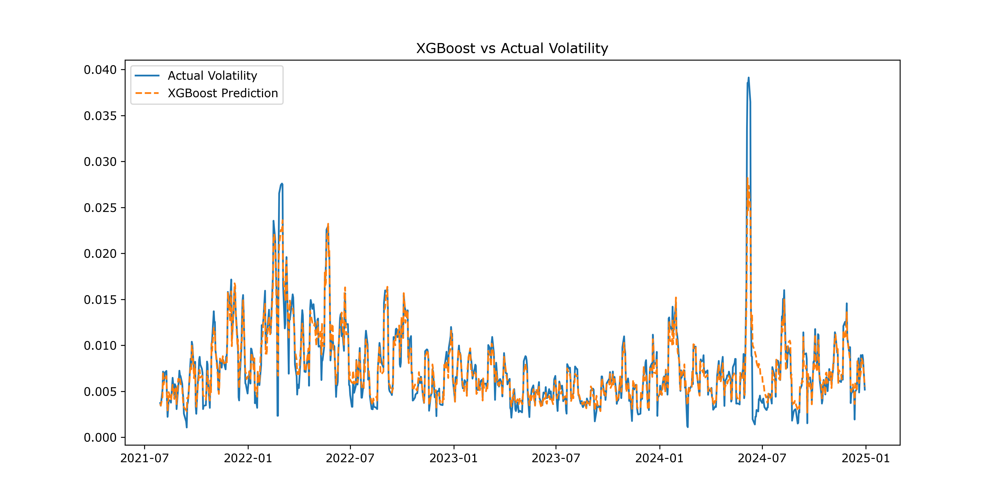
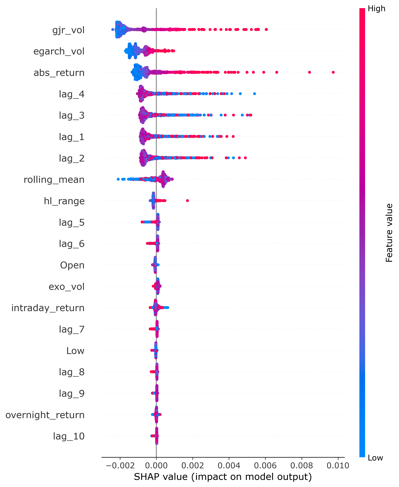
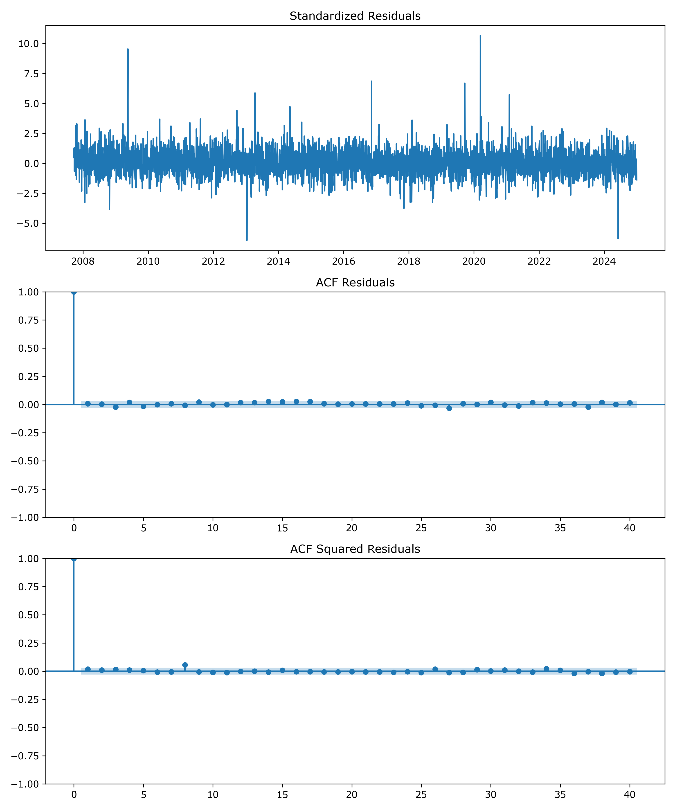

# 📊 Live Volatility Prediction System

A hybrid statistical and machine learning pipeline for forecasting financial market volatility. This system models volatility dynamics using **GARCH (Generalized Autoregressive Conditional Heteroskedasticity)** models and utilizes **XGBoost Regression** to predict rolling volatility based on historical returns, lagged volatility features, and external macroeconomic indicators (Gold, USD/INR, Crude Oil, and Nifty IT).

## 🚀 Key Features

* **Live Streamlit Dashboard**: A web interface to view real-time volatility predictions, compare actual vs. predicted values, and inspect recent data.
* **FastAPI Web API**: Lightweight REST API to query current actual and predicted volatility values.
* **GARCH Modeling**: Conditional volatility estimation including support for exogenous regressors.
* **XGBoost Predictor**: Machine learning model capturing complex non-linear relationships.
* **Feature Engineering**: Auto-generates lagged volatility metrics, intraday ranges, and overnight returns.
* **Walk-Forward Validation**: Comprehensive testing suite simulating historical live trading deployment.

---

## 📁 Project Structure

```text
github_publish/
├── data/
│   └── processed/
│       └── nifty500_dataset.csv     # Filtered processed dataset
├── images/
│   ├── distribution.png             # Residual distribution diagnostics
│   ├── error_comparison.png         # Comparison of prediction errors
│   ├── feature_importance.png       # XGBoost feature importances
│   ├── garch_family.png             # GARCH variant comparison
│   ├── garch_volatility.png         # GARCH conditional volatility
│   ├── leverage_effect.png          # EGARCH leverage effect scatter plot
│   ├── residual_diagnostics.png     # GARCH residuals ACF plots
│   ├── returns_volatility.png       # Volatility clustering visualization
│   ├── rolling_volatility.png       # Historical rolling volatility
│   ├── shap_bar.png                 # SHAP global feature importances
│   ├── shap_summary.png             # SHAP feature impact bee-swarm plot
│   └── xgb_vs_actual.png            # XGBoost predicted vs actual volatility
├── api.py                           # FastAPI web API service
├── app.py                           # Streamlit live dashboard application
├── config.py                        # Model parameters & config variables
├── data_pipeline.py                 # Data cleansing & preprocessing pipeline
├── download_data.py                 # Utility script to download market data via yfinance
├── feature_engineering.py           # Feature creation (lags, intraday returns, etc.)
├── garch_models.py                  # GARCH fitting and volatility estimation
├── live.py                          # Live data prediction run-script
├── model_eval2.py                   # Advanced statistical model evaluation script
├── model_evaluation.py              # Performance metric computation script
├── plots.py                         # Plotting functions for model analysis
├── predict_pipeline.py              # Inference pipeline orchestration
├── standardized_rmse.py             # Volatility-scaled RMSE calculations
├── train_pipeline.py                # Model training and artifact generation script
├── walk_forward.py                  # Backtesting walk-forward validation script
├── xgboost_model.py                 # XGBoost wrapper class
├── features.pkl                     # Serialized feature column list
├── garch.pkl                        # Serialized pre-trained GARCH model
├── meta_model.pkl                   # Serialized meta model weights/parameters
├── scaler.pkl                       # Serialized feature scaler
├── xgb_model.pkl                    # Serialized pre-trained XGBoost model
├── nifty50_dataset.csv              # Small sample historical dataset (Nifty50)
├── requirements.txt                 # Project dependencies list
└── .gitignore                       # Clean Git configuration exclusions
```

---

## 🛠️ Installation & Setup

### 1. Clone the repository
```bash
git clone <your-repository-url>
cd github_publish
```

### 2. Set up a virtual environment
```bash
# Using python venv
python -m venv venv

# Activate on Windows
venv\Scripts\activate

# Activate on macOS/Linux
source venv/bin/activate
```

### 3. Install dependencies
```bash
pip install -r requirements.txt
```

---

## 💻 How to Run

### Live Web Dashboard
Run the interactive Streamlit dashboard:
```bash
streamlit run app.py
```
This will open the dashboard in your default browser (usually at `http://localhost:8501`).

### REST API Service
Start the FastAPI server:
```bash
uvicorn api:app --reload
```
Access the REST endpoint at `http://127.0.0.1:8000/predict` or view interactive documentation at `http://127.0.0.1:8000/docs`.

### Backtest & Model Evaluation
Run the walk-forward evaluation script to run a historical backtest of the hybrid model:
```bash
python walk_forward.py
```

---

## 📊 Visual Diagnostics & Results

Here are some outputs from the analysis pipeline (stored in `images/`):

### Model Predictions vs. Actual Volatility


### SHAP Feature Interpretability


### Residual Diagnostics (GARCH)

